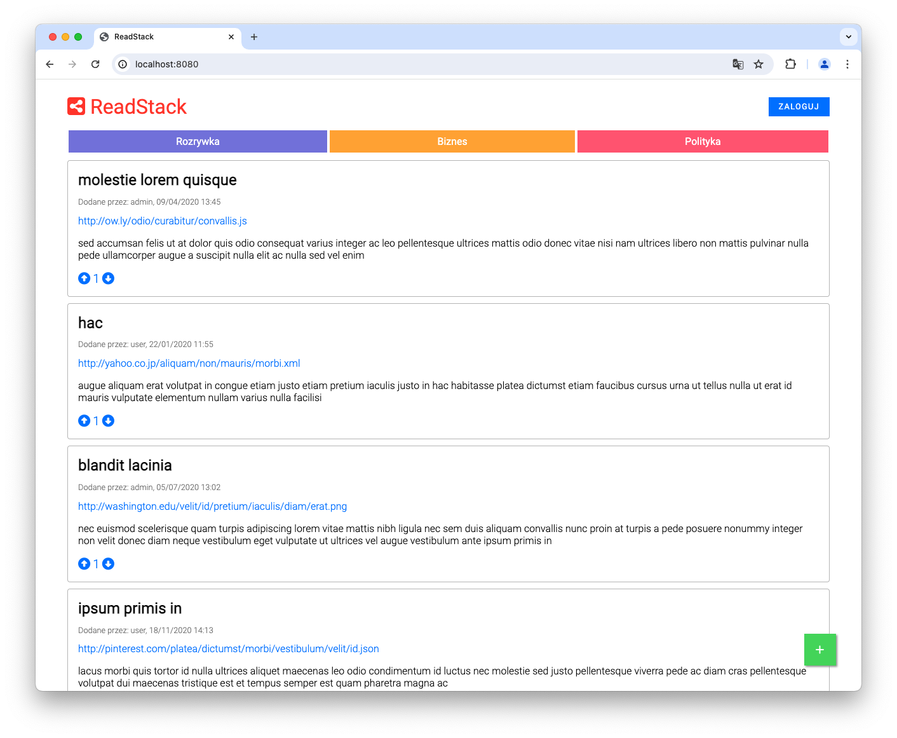
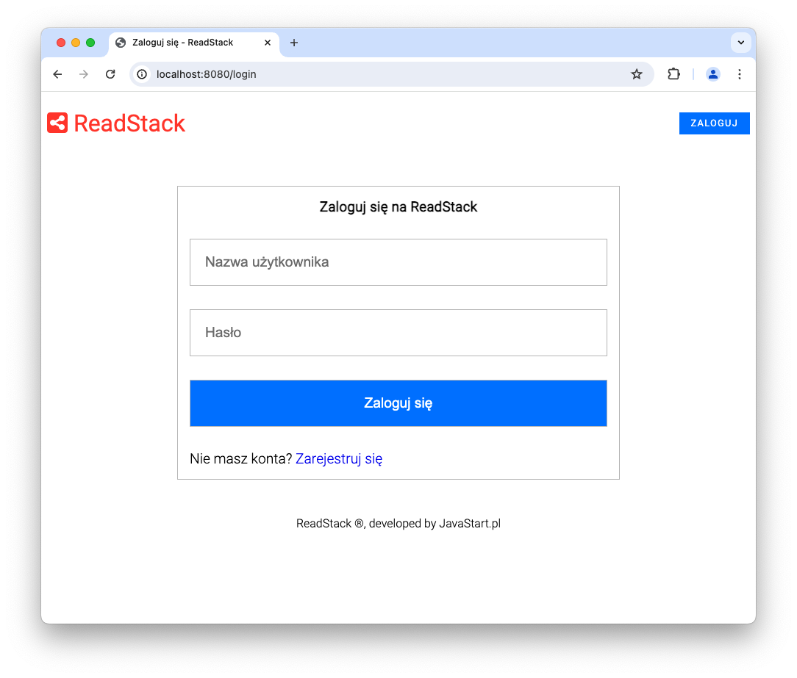

# READSTACK

## Tech stack

Demo WebApp with basic Jakarta EE 10 stack.
Web layer: Servlets, JSP, JSTL, EL, HTML, CSS with Flexbox
Database layer: JDBC with MySQL
Application provides authentication with form mechanism.

Application uses `war` packaging and is deployed on Tomcat10.

If you want to run the app locally, without docker, you have to provide additional env variables for database:
```
JAVA_OPTS=-Ddb_username=<dbuser> -Ddb_password=<dbpass> -Ddb_host=<dbhost> -Ddb_database=<dbname>
```

## How to run this app

```shell
docker compose up -d
```



